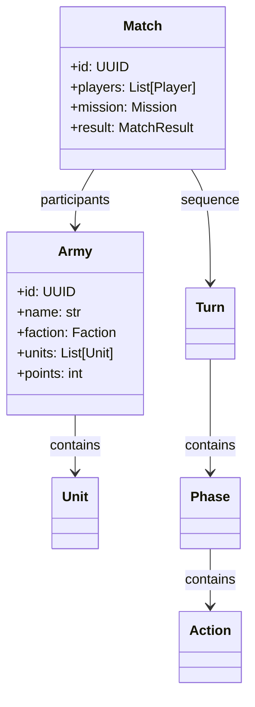

# Vindicta-Core Architecture

> Agent context artifact for the central domain modeling library.

## Purpose

Central domain modeling library defining shared interface contracts and base schemas used by all platform components.

## Technology Stack

- **Language**: Python 3.11+
- **Validation**: Pydantic v2
- **Testing**: Pytest
- **Package**: pip-installable library

## Directory Structure

```
├── src/vindicta_core/
│   ├── models/         # Domain models (Army, Unit, Match, etc.)
│   ├── schemas/        # Pydantic schemas for API contracts
│   ├── validators/     # Domain validation logic
│   ├── events/         # Event sourcing primitives
│   └── types/          # Shared type definitions
├── tests/
└── docs/
```

## Core Domain Models



## Integration Points

| Consumer       | Usage             |
| -------------- | ----------------- |
| Vindicta-API   | Schema validation |
| Meta-Oracle    | Domain types      |
| WARScribe-Core | Event models      |
| Primordia-AI   | State encoding    |
