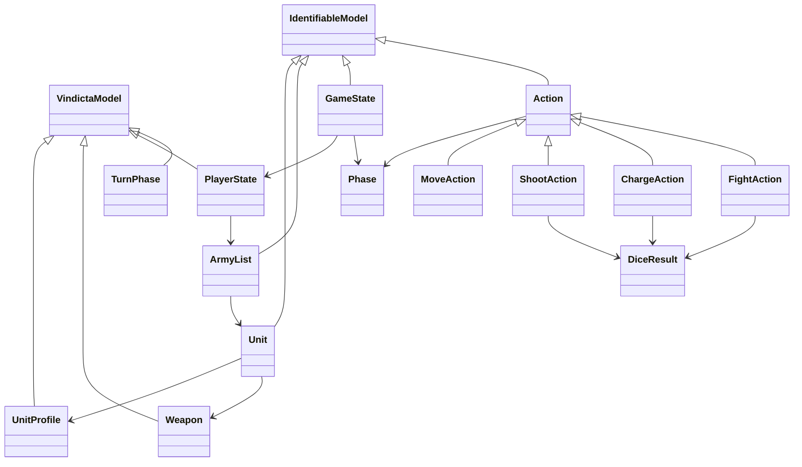

# Implementation Plan: Wargame Domain Models

**Feature Branch**: `041-wargame-domain-models`
**Spec**: [spec.md](spec.md)
**Created**: 2026-02-08
**Status**: Draft

---

## 1. Technical Context

### Current State

- `vindicta_core` has 4 infrastructure models: `VindictaModel`, `TimestampedModel`, `IdentifiableModel`, `EntropyProof`, `DiceResult`, `GasTankState`, `CostEstimate`
- All models live in a single `models.py` (148 lines)
- Parallel spec CORE-004 (038) plans to refactor these into domain subpackages
- No wargame-specific models exist

### Target State

- New `vindicta_core/wargame/` subpackage containing all game models
- 5 domain model files: `unit.py`, `army.py`, `game.py`, `phase.py`, `actions.py`
- Full test suite achieving 90%+ coverage on the new models
- JSON round-trip serialization tests
- Immutability/freeze tests for AI consumption

### Dependencies

| Dependency | Version | Purpose               |
| ---------- | ------- | --------------------- |
| pydantic   | ^2.0    | Model definitions     |
| python     | ^3.11   | Type hints, `StrEnum` |
| pytest     | ^8.0    | Testing (dev)         |
| mypy       | ^1.0    | Type checking (dev)   |

### Constitution Compliance

| Principle                     | How We Comply                                |
| ----------------------------- | -------------------------------------------- |
| II. SDD                       | This SDD bundle (spec.md, plan.md, tasks.md) |
| III. Economic Prime Directive | Zero new dependencies                        |
| VI. Mechanical Fidelity       | EntropyProof on all dice-dependent actions   |
| VII. Vanilla-Forward          | Pure Python, no external frameworks          |
| XVI. Async-First              | All models serializable for async transport  |

---

## 2. Architecture

### Package Structure

```
src/vindicta_core/
├── __init__.py          # MODIFY: add wargame exports
├── models.py            # UNMODIFIED (existing infrastructure models)
├── interfaces.py        # UNMODIFIED
├── settings.py          # UNMODIFIED
└── wargame/             # NEW package
    ├── __init__.py      # Re-exports all public models
    ├── phase.py         # Phase enum, TurnPhase
    ├── unit.py          # UnitProfile, Weapon, Unit
    ├── army.py          # ArmyList
    ├── actions.py       # Action, MoveAction, ShootAction, ChargeAction, FightAction, ActionUnion
    └── game.py          # PlayerState, GameState
```

### Dependency Graph (within wargame package)

```
phase.py          ← no internal deps (leaf)
    ↑
unit.py           ← imports from models.py (VindictaModel, IdentifiableModel)
    ↑
army.py           ← imports Unit from unit.py
    ↑
actions.py        ← imports Phase, DiceResult, IdentifiableModel
    ↑
game.py           ← imports PlayerState deps, ArmyList, Phase, Action
```

**Rule**: Dependencies flow downward only. No circular imports.

### Data Model Diagram



---

## 3. Implementation Details

### 3.1 Phase Enum (`phase.py`)

```python
from enum import StrEnum
from vindicta_core.models import VindictaModel

class Phase(StrEnum):
    COMMAND = "command"
    MOVEMENT = "movement"
    SHOOTING = "shooting"
    CHARGE = "charge"
    FIGHT = "fight"
    MORALE = "morale"  # reserved for future editions

class TurnPhase(VindictaModel):
    turn_number: int = Field(..., ge=1)
    phase: Phase
    active_player: Literal["A", "B"]
```

### 3.2 Unit Model (`unit.py`)

- `UnitProfile`: Mutable stat block, all ints except `movement` (str for special cases like "6+D6")
- `Weapon`: Name + stat line + keywords. String `attacks`/`damage` fields for variable values
- `Unit`: Inherits `IdentifiableModel` for UUID + timestamps. Tracks `models_count` and `models_remaining`
- Validators: `models_remaining <= models_count`, `points_cost >= 0`

### 3.3 Army List (`army.py`)

- `ArmyList`: Collection of `Unit` objects with faction, subfaction, points tracking
- Validators: `total_points <= points_limit` (warning, not error — allow over-point lists)
- Method: `validate_points(limit: int) -> bool`

### 3.4 Actions (`actions.py`)

- Base `Action` with discriminated union via `action_type` literal field
- `ActionUnion = Annotated[Union[MoveAction, ShootAction, ChargeAction, FightAction], Field(discriminator='action_type')]`
- Dice-dependent actions (`ShootAction`, `FightAction`, `ChargeAction`) reference `DiceResult` from existing models
- Each action carries `phase` field validated against expected phase (e.g., `ShootAction` must have `phase=Phase.SHOOTING`)

### 3.5 Game State (`game.py`)

- `PlayerState`: Wraps `ArmyList` with game-progress fields (CP, VP, secondary)
- `GameState`: Two players, current turn/phase/player, action log, completion flag
- `freeze()` method: Returns deep copy with `model_config = ConfigDict(frozen=True)` applied

### 3.6 Freeze Implementation

```python
class GameState(IdentifiableModel):
    model_config = ConfigDict(frozen=False)  # mutable by default

    def freeze(self) -> "FrozenGameState":
        """Create an immutable snapshot for AI consumption."""
        data = self.model_dump()
        return FrozenGameState(**data)

class FrozenGameState(GameState):
    model_config = ConfigDict(frozen=True)
```

---

## 4. Test Plan

### Unit Tests (`tests/test_wargame_models.py`)

| Test                               | Description                        |
| ---------------------------------- | ---------------------------------- |
| `test_unit_creation`               | Create unit with all fields        |
| `test_unit_profile_validation`     | Profile stat ranges                |
| `test_weapon_creation`             | Weapon with keywords               |
| `test_army_list_points`            | Points calculation and validation  |
| `test_army_list_empty`             | Empty unit list (valid)            |
| `test_phase_enum_values`           | All phase string values            |
| `test_action_discriminated_union`  | Polymorphic action deserialization |
| `test_move_action`                 | Move action creation               |
| `test_shoot_action_with_dice`      | Shoot action with DiceResult       |
| `test_charge_action`               | Charge action with roll            |
| `test_fight_action`                | Fight action with dice             |
| `test_player_state`                | Player state with CP/VP            |
| `test_game_state_creation`         | Full game state                    |
| `test_game_state_turn_progression` | Turn/phase sequencing              |

### Serialization Tests (`tests/test_wargame_serialization.py`)

| Test                               | Description                       |
| ---------------------------------- | --------------------------------- |
| `test_unit_json_roundtrip`         | Serialize → deserialize → compare |
| `test_army_list_json_roundtrip`    | Full army list JSON fidelity      |
| `test_game_state_json_roundtrip`   | Complete game state transport     |
| `test_action_union_json_roundtrip` | Polymorphic action serialization  |
| `test_json_schema_generation`      | `model_json_schema()` is valid    |

### Freeze Tests (`tests/test_wargame_freeze.py`)

| Test                                   | Description                                |
| -------------------------------------- | ------------------------------------------ |
| `test_frozen_state_immutable`          | Assignment raises `ValidationError`        |
| `test_frozen_state_hash`               | Deterministic hash for identical states    |
| `test_freeze_creates_independent_copy` | Mutation of original doesn't affect frozen |

---

## 5. Migration / Rollout

### Rollout Steps

1. Create `wargame/` subpackage with all model files
2. Add re-exports to `wargame/__init__.py`
3. Add wargame to `vindicta_core/__init__.py` exports
4. Create and run test suite
5. Run mypy strict mode: `uv run mypy src/ --strict`
6. Push branch, create PR, run CI

### Backward Compatibility

- **No breaking changes**: All existing imports remain unchanged
- New models are additive — no modifications to `models.py` or `interfaces.py`
- Downstream consumers can start importing immediately after merge

---

## 6. Verification Plan

### Automated

```bash
# Run all tests
uv run pytest tests/ -v --tb=short

# Run only wargame tests
uv run pytest tests/test_wargame*.py -v

# Type checking
uv run mypy src/vindicta_core/wargame/ --strict

# Coverage check
uv run pytest tests/test_wargame*.py --cov=vindicta_core.wargame --cov-report=term
```

### Manual Verification

- [ ] Confirm all models appear in `python -c "from vindicta_core.wargame import *; print(dir())"`
- [ ] Verify JSON Schema output for each model via `model_json_schema()`
- [ ] Confirm frozen state raises on mutation
